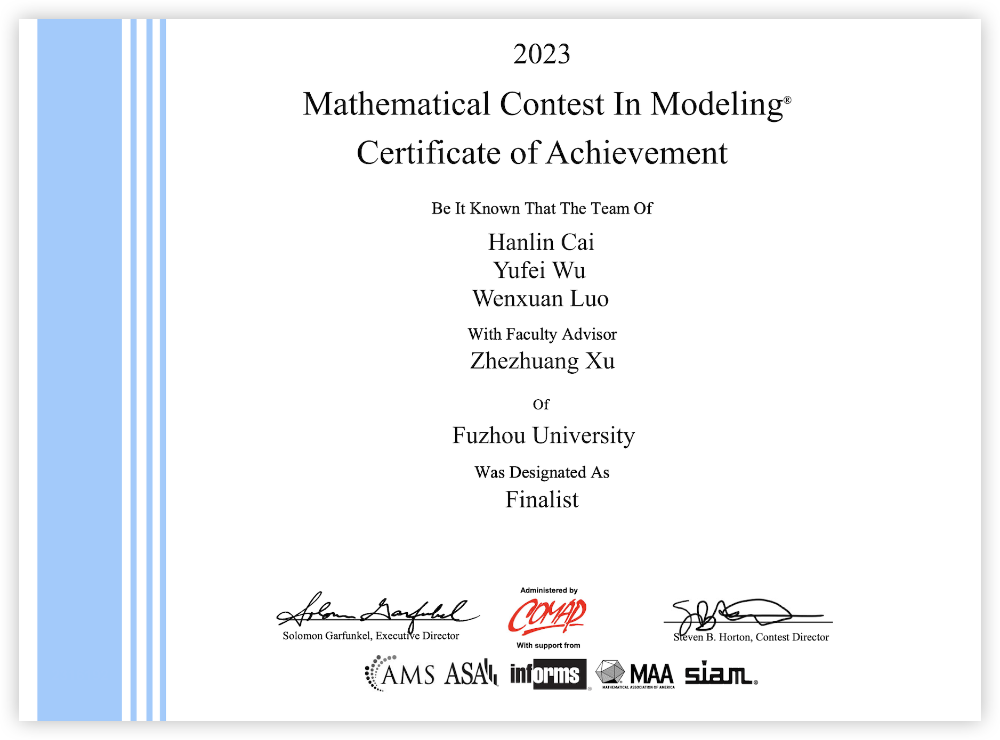

# COMAP-MCM-2023

**MCM-B: Reshape the Crowning Glory of Maasai Mara (2316192)**

### Team Members

- [Mr. Hanlin Cai](https://caihanlin.com/) (Leader, writing)
- Ms. Yufei Wu (Modeling)
- Mr. Wenxuan Luo (Coding)
- [Prof. Zhezhuang Xu](https://dqxy.fzu.edu.cn/info/1102/3547.htm) (Advisor)
- [Fuzhou University](https://www.fzu.edu.cn/)

## This repo contains

- Our MCM Competition Paper (.pdf)
- Word Template (.word)
- Figure Template (.pptx)
- Codes of our Paper (Matlab, Python)
- My Personal MCM Note (.pdf)

## 本仓库包括

- [x] 我们的美赛论文PDF
- [x] 论文的Word模版
- [x] 图片制作的PPT模版（包括所有图片）
- [x] 模型的代码（Matlab, Python）
- [x] 我的美赛笔记（绘图、写作、团队）

 

MCM-2316192美赛材料由本团队汇总整理。材料完全免费开源，支持任意方式转载，请勿商用。

如果你通过转售本材料获利，全部归你，但需要注意的是：销售行为与本团队无关；如果你通过付费手段获得本材料，说明材料并非第一手转载，如果你注意到本声明，请勿再次二次售卖本材料，感谢理解支持！

倡导知识付费，是因为知识创建整理的过程复杂，需要付诸许多心血，而人的精力实在有限，知识付费让这一切关系变得健康；相反地，倡导知识开源，恰恰也正是因为知识宝贵，所以需要让更多人受益，从而充分发挥人的劳动价值，这是在计划里的捐献。

最后的最后，祝你比赛顺利，学业有成。我们高处见。
